# 5 МОДЕЛЬ ПРОГРАМНОГО ДОДАТКУ

Гості, пасажири, водії, контролери, диспетчери, менеджери, бухгалтери та представники муніципалітету користуються окремими інтерфейсами відповідно до своєї ролі в системі управління міським транспортом. Рівень представлення побудований у вигляді односторінкового веб-застосунку (SPA) на базі React з використанням TanStack Router для маршрутизації.

## 5.1 Ієрархія сторінок для незареєстрованого користувача

Гість взаємодіє з системою через загальнодоступні інтерфейси. Послідовність переходів по сторінках додатку для гостя відображена на рисунку 5.1.

**Рисунок 5.1 – Ієрархія сторінок додатку для незареєстрованого користувача**

Гість починає роботу з головної сторінки, де відображається загальна інформація про систему міського транспорту: статистика маршрутів (150+), зупинок (2500+), транспортних засобів (500+) та показник надійності системи (99.5%). Використовуючи інтерактивну карту на базі MapLibre GL, користувач може переглядати маршрути, планувати поїздки з використанням GPS-геолокації для пошуку найближчих зупинок. На сторінці контактів гість може переглянути розділ FAQ та подати скаргу або пропозицію без реєстрації.

## 5.2 Ієрархія сторінок для пасажира

Після успішної авторизації пасажир отримує доступ до особистого кабінету з розширеним функціоналом. Ієрархія сторінок для пасажира відображена на рисунку 5.2.

**Рисунок 5.2 – Ієрархія сторінок додатку для пасажира**

Пасажир має доступ до особистого профілю, де відображається інформація про користувача та транспортну картку з поточним балансом. Система дозволяє поповнювати картку, переглядати історію поїздок, а також керувати штрафами — переглядати їх статус, здійснювати оплату або подавати апеляцію.

## 5.3 Ієрархія сторінок для водія

Водій має доступ до спеціалізованого інтерфейсу для управління рейсами та відстеження GPS-позиції. Ієрархія сторінок для водія відображена на рисунку 5.3.

**Рисунок 5.3 – Ієрархія сторінок додатку для водія**

Інтерфейс водія організований у вигляді вкладок. На вкладці «Огляд» відображається профіль водія з категоріями прав та інформацією про активний рейс. «Розклад» дозволяє переглядати заплановані рейси на обрану дату. «Управління» забезпечує повний цикл роботи з рейсом: вибір маршруту, початок рейсу, введення кількості пасажирів та завершення. Під час активного рейсу система автоматично веде GPS-трекінг позиції транспортного засобу.

## 5.4 Ієрархія сторінок для контролера

Контролер має спеціалізований інтерфейс для перевірки квитків та виписування штрафів. Ієрархія сторінок для контролера відображена на рисунку 5.4.

**Рисунок 5.4 – Ієрархія сторінок додатку для контролера**

Інтерфейс контролера побудований як покроковий процес. На першому кроці контролер обирає транспортний засіб за бортовим номером та переглядає активні рейси. Другий крок — перевірка транспортної картки пасажира: введення номера картки, перегляд балансу та дати останньої валідації. У разі виявлення порушення, на третьому кроці контролер вводить суму штрафу та причину, після чого система автоматично прив'язує штраф до конкретного рейсу та водія.

## 5.5 Ієрархія сторінок для диспетчера

Диспетчер має найбільш розгалужений інтерфейс для оперативного управління рухом транспорту. Ієрархія сторінок для диспетчера відображена на рисунку 5.5.

**Рисунок 5.5 – Ієрархія сторінок додатку для диспетчера**

Диспетчер координує роботу всього транспортного парку через шість функціональних вкладок. «Огляд» надає загальну статистику активних рейсів, водіїв та транспорту. «Рейси» дозволяє створювати окремі рейси або генерувати їх автоматично на основі розкладу. «Розклади» забезпечує управління графіками руху. «Призначення» відповідає за закріплення водіїв за транспортними засобами. «Моніторинг» відображає позиції транспорту в реальному часі на карті. «Відхилення» фіксує порушення графіку руху.

## 5.6 Ієрархія сторінок для менеджера

Менеджер відповідає за кадрове забезпечення та управління транспортним парком. Ієрархія сторінок для менеджера відображена на рисунку 5.6.

**Рисунок 5.6 – Ієрархія сторінок додатку для менеджера**

Менеджер працює з трьома основними напрямками. Вкладка «Водії» дозволяє переглядати список водіїв та наймати нових із заповненням детальної форми (логін, пошта, телефон, ПІБ, номер посвідчення, категорії прав, паспортні дані). Вкладка «Транспорт» забезпечує додавання нових транспортних засобів із вибором типу транспорту, моделі та призначеного маршруту. Вкладка «Персонал» дозволяє створювати облікові записи для співробітників різних ролей: диспетчер, контролер, бухгалтер, представник муніципалітету та менеджер.

## 5.7 Ієрархія сторінок для бухгалтера

Бухгалтер відповідає за фінансовий облік та звітність підприємства. Ієрархія сторінок для бухгалтера відображена на рисунку 5.7.

**Рисунок 5.7 – Ієрархія сторінок додатку для бухгалтера**

Бухгалтер має доступ до п'яти функціональних вкладок. «Аналітика» відображає фінансову панель з ключовими показниками, трендами та виконанням бюджету. «Доходи» дозволяє вносити записи про надходження з різних джерел: державний бюджет, продаж квитків, штрафи та інші. «Зарплати» забезпечує облік виплат водіям. «Витрати» фіксує витрати за категоріями: пальне, ремонт, запчастини, мийка, страховка, комунальні послуги. «Звіт» генерує комплексний фінансовий звіт за обраний період із порівнянням планових та фактичних показників.

## 5.8 Ієрархія сторінок для представника муніципалітету

Представник муніципалітету відповідає за планування маршрутної мережі та аналіз пасажиропотоку. Ієрархія сторінок для представника муніципалітету відображена на рисунку 5.8.

**Рисунок 5.8 – Ієрархія сторінок додатку для представника муніципалітету**

Представник муніципалітету має широкі повноваження з планування транспортної інфраструктури. Вкладка «Зупинки» дозволяє створювати та редагувати зупинки з вказівкою координат. «Проектування» — конструктор маршрутів, де задається номер маршруту, тип транспорту, напрямок руху, послідовність зупинок та геометрія шляху. «Маршрути» відображає існуючі маршрути з візуалізацією на карті та можливістю активації/деактивації. «Аналітика» надає інструменти для аналізу пасажиропотоку: графіки, топ маршрутів за завантаженістю, тренди за обраний період. «Скарги» дозволяє переглядати звернення громадян та оновлювати їх статус обробки.

## 5.9 Загальна схема навігації системи

Загальна схема навігації системи з урахуванням всіх ролей та переходів між сторінками наведена на рисунку 5.9.

**Рисунок 5.9 – Загальна схема навігації системи**

## 5.10 Модель прикладного компоненту

На рівні прикладного компоненту знаходяться класи, що відповідають за обробку вхідних запитів та координацію бізнес-процесів. Діаграма класів моделей даних наведена на рисунку 5.10.

**Рисунок 5.10 – Діаграма моделей даних інформаційної системи з атрибутами**

Атрибути кожного класу відповідають полям відповідних реляційних таблиць та результатам виконання збережених процедур PostgreSQL. Класи VehicleGpsLog та UserGpsLog пов'язані з відповідними логами GPS-трекінгу серверної частини СУБД. Класи конфігурації сесії (SessionService, DbService) не мають відображення у фізичних таблицях БД і призначені для реалізації безпечного перемикання підключень до бази даних залежно від ролі користувача в поточній сесії.

## 5.11 Діаграма зв'язків моделей даних

На рисунку 5.11 наведені модельні класи із зазначенням ключових зв'язків між ними.

```mermaid
flowchart LR
    TransportType --> Route
    TransportType --> VehicleModel

    Route --> RouteStop
    Route --> RoutePoint
    Route --> Vehicle
    Route --> Schedule
    Route --> Trip

    Stop --> RouteStop

    VehicleModel --> Vehicle

    Vehicle --> DriverVehicleAssignment
    Vehicle --> VehicleGpsLog
    Vehicle --> Schedule

    Driver --> DriverVehicleAssignment
    Driver --> Trip
    Driver --> SalaryPayment

    User --> TransportCard
    User --> Fine
    User --> UserGpsLog
    User --> ComplaintSuggestion

    TransportCard --> CardTopUp
    TransportCard --> Ticket

    Trip --> Ticket
    Trip --> Fine

    Fine --> FineAppeal
```

**Рисунок 5.11 – Діаграма моделей даних інформаційної системи зі зв'язками**

Реалізація цих зв'язків відображає специфіку функціонування предметної області «Міський транспорт» та організовує коректний обмін даними між ключовими об'єктами системи. Кожна асоціація в моделі, як-от ідентифікація водія та конкретного транспортного засобу в межах одного призначення, або прив'язка квитка до конкретного рейсу та транспортної картки, є критично важливою для забезпечення логічної цілісності бізнес-процесів.

## 5.12 Сервісний рівень застосунку

Класи-сервіси виступають центральною ланкою прикладного шару застосунку, де зосереджена основна бізнес-поведінка системи. Вони виконують роль координаторів: приймають запити від контролерів, перевіряють права доступу та делегують виконання складних операцій базі даних. Головною особливістю цього шару є інкапсуляція механізмів виклику збережених процедур і функцій PostgreSQL. Такий підхід дозволяє перенести важкі обчислення та перевірки обмежень безпосередньо на бік сервера бази даних.

Сервіси забезпечують атомарність операцій за допомогою управління транзакціями на рівні бази даних. Це гарантує, що при виконанні комплексних дій — наприклад, при одночасному створенні рейсу, призначенні водія та оновленні розкладу — дані залишаться в узгодженому стані навіть у разі виникнення помилок. Структурна організація сервісів наведена на рисунку 5.12.

**Рисунок 5.12 – Діаграма сервісів інформаційної системи**

## 5.13 Контролери REST API

Класи контролерів виступають фундаментальними компонентами прикладного рівня, що виконують роль посередника між інтерфейсом користувача та логікою обробки даних. Основна функція контролерів полягає в перехопленні вхідних HTTP-запитів, валідації параметрів та координації подальшої взаємодії з сервісним шаром.

В архітектурі системи використовується REST API підхід до побудови контролерів на базі NestJS framework. Всі контролери працюють виключно з JSON-форматом даних, що споживається клієнтським SPA-застосунком на React. Такий підхід дозволяє реалізувати динамічне оновлення інтерфейсу без повного перезавантаження сторінок. Структура контролерів наведена на рисунку 5.13.

**Рисунок 5.13 – Діаграма контролерів інформаційної системи**

Сервіси та контролери в розробленій інформаційній системі не мають прямого наслідування, оскільки виконують різні функціональні ролі. Їх ідентифікація та підключення до контексту виконання здійснюється за допомогою декораторів NestJS: @Controller для контролерів та @Injectable для сервісів. Взаємодія між ними базується на принципі впровадження залежностей (Dependency Injection), що забезпечується фреймворком NestJS.

Ієрархії сторінок для всіх ролей наведені в додатку Д.
